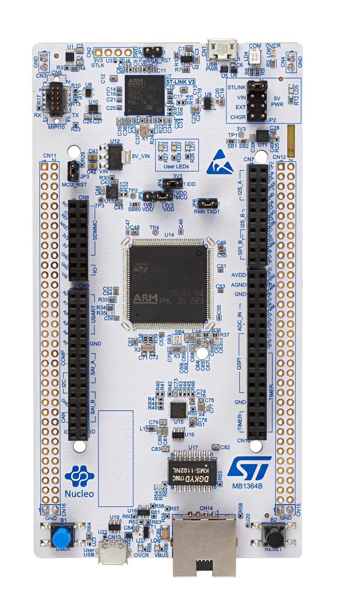

# reflected-crc32-stm32
Reflected CRC32 Communication on STM32H753ZI Using Arduino IDE

This project implements a reflected CRC32 algorithm on STM32H753ZI boards to ensure reliable communication between a transmitter and receiver. The setup involves two STM32 boards, each connected to a common ground via a PC (laptop). The transmitter board receives a message from the PC, calculates the CRC32 checksum, and sends the message to the receiver board.

The receiver board performs its own CRC calculation on the received message, compares it with the transmitter's checksum, and verifies its correctness. If the checksums match, the receiver forwards the message back to the PC, completing the communication loop.

The project is developed using Arduino and ensures data integrity during transmission through cyclic redundancy checks
(CRC). This process simulates a communication protocol with error-checking capabilities commonly used in embedded systems.

  

